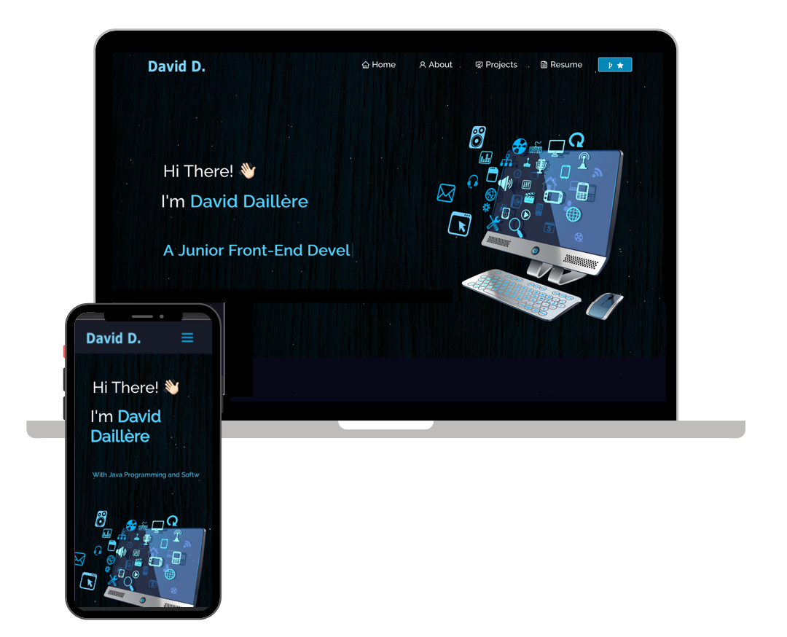

<h2 align="center">
  Portfolio Website 
  <a href="https://portfolio-1-daviddaill.vercel.app/" target="_blank">David D.</a>
</h2>

  

 

<h3 align="center">
    🔹
    <a href="https://github.com/Daviddaill/Portfolio-1/issues">Report Bug</a> &nbsp; &nbsp;
    🔹
    <a href="https://github.com/Daviddaill/Portfolio-1/issues">Request Feature</a>
</h3>

## Built With

My personal portfolio <a href="https://portfolio-1-daviddaill.vercel.app/" target="_blank">David Daillere</a> which features some of my github projects as well as my resume and technical skills. 

This project was built using these technologies.

- React.js
- Node.js
- CSS3
- VsCode
- Vercel

## Features

Special Thanks to @soumyajit4419 !

